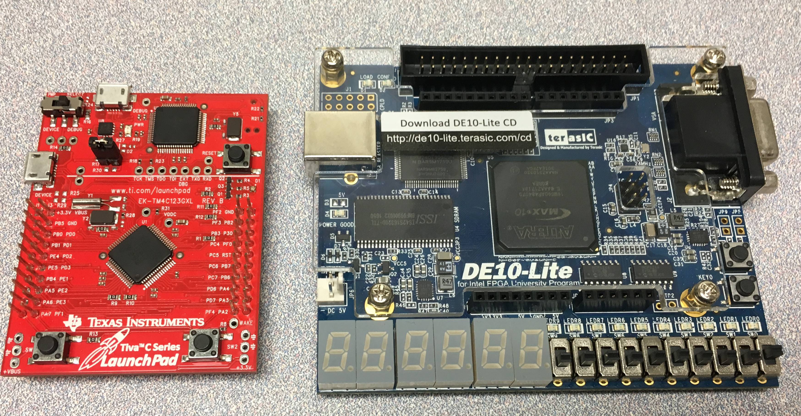

# microcontroller-class-kit

This is a basic kit that includes one FPGA board, one TI ARM Cortex M4 Launchpad board, and jumper wires.   
This kit will be used throughout ESET 349 course in *Spring of 2019*. Students **do not** require to bring their own for the course since they will be accessible during lab hours. However, it is recommended to have your own kit for their own learning purposes.

The details were listed below. They are available from several vendors such as TI, Amazon, digikey, or mouser.  

  

  

This basic kit:

- DE10-Lite Board
https://www.terasic.com.tw/cgi-bin/page/archive.pl?Language=English&No=1021

- ARM Cortex-M4F Based MCU TM4C123G Launchpad Evaluation Kit (EK-TM4C123GXL)  
http://www.ti.com/tool/EK-TM4C123GXL?DCMP=stellaris-launchpad&HQS=tm4c123g-launchpad

- Breadboard Jumper Wire Set (Male to Female, Male to Male, and Female to Female)   
You can find several choices from many vendors
